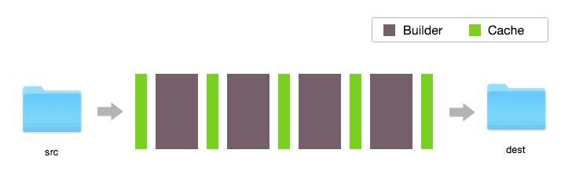

<div align="center">
  <h1>Exhibit.js (alpha)</h1>
  
  <br><br>
  <p><b>Real-time incremental build.</b></p>
  <br><br>
  <p><a href="https://npmjs.org/package/exhibit"></a> &nbsp;<a href="http://travis-ci.org/exhibitjs/exhibit"></a> &nbsp;<a href="https://david-dm.org/exhibitjs/exhibit"></a></p>
  <p><i>Requires Node 4</i></p>
</div>


---

Jump to:&nbsp; [Getting started](#getting-started) &nbsp;|&nbsp; [Using with gulp](#using-with-gulp) &nbsp;|&nbsp; [Builders](#builders)

---


## What is Exhibit?

Exhibit is a library that helps you set up an **incremental flow of files** from one directory to another, via an arbitrary series of build steps.

It has a middleware-style API:

```js
exhibit('./src')
  .use(babel())
  .use(sass())
  .use(autoprefixer())
  .use(rev())
  .build('./dist', {watch: true});
```

The above snippet reads all files in `./src`, pushes the whole app through four ‘builders’, and outputs the result to `./dist`.

Then, because of `{watch: true}`, it watches `./src` for incremental changes, only doing the minimum work possible for each rebuild.


## Features

- designed for the smoothest watch-and-rebuild experience
- rebuilds are 100% incremental, therefore insanely fast
- everything is a plugin
- promise-driven API
- concise logging of what's being built
- no temp files

It's ideal for building static sites, single-page apps, browser extensions, and other front-end projects. And you can wire it up to BrowserSync with one line.


## The fastest rebuilds ever

Parallelized build systems often feel like [task spaghetti](https://github.com/google/web-starter-kit/blob/master/gulpfile.babel.js). The linked example works well, but it's hard to follow, and it's still inefficient when it comes to rebuilds.

Exhibit keeps things simple with a series approach. And a *lot* of in-memory caching.



Every cache contains the entire application 'as it stands'. This, combined with a smart batching system that remembers dependencies per-step across multiple builds, means Exhibit knows exactly what needs to be rebuilt after each change.

This makes it faster where it really matters: **rebuilding after small changes**.

For more info, see the [technical overview](docs/technical-overview.md).


## Getting started

The best way to start (for now) is to check out the [examples in this repo](examples).

<!-- - [Web Starter Kit](https://github.com/exhibitjs/web-starter-kit) – a fork of Google's excellent front end boilerplate project, modified to use Exhibit. -->

<!-- - Yeoman generator: [exhibit-webapp](https://github.com/exhibitjs/generator-exhibit-webapp) – a fork of Yeoman's gulp-webapp project, modified to use Exhibit. -->

(Coming soon: a Yeoman generator, and a fork of Web Starter Kit adapted to use Exhibit.)


## Installation

Requires [Node 4](https://nodejs.org/en/).

```sh
$ npm install exhibit
```


## API

```js
var exhibit = require('exhibit');
```

The core API is tiny:

- [`exhibit('src')`](docs/api/exhibit.md) returns an Exhibit chain that will read from the './src' directory.

- [`.use(builder)`](docs/api/use.md) adds a builder to the chain.

- [`.build('dist')`](docs/api/build.md) starts building to `./dist`' and optionally starts a server.

See the [full docs](docs) for more details.


## Builders

### Loading builders from plugins

Builder plugins are simply NPM modules named `exhibit-builder-*` and include:

- [Babel](https://github.com/exhibitjs/exhibit-builder-babel)
- [Browserify](https://github.com/exhibitjs/exhibit-builder-browserify)
- [Sass](https://github.com/exhibitjs/exhibit-builder-sass)
- [Autoprefixer](https://github.com/exhibitjs/exhibit-builder-autoprefixer)
- [Uglify](https://github.com/exhibitjs/exhibit-builder-uglify)

More on the way: Webpack, Jade, Less, Stylus. ([Open an issue](https://github.com/exhibitjs/exhibit/issues) to request another.)

#### Auto-loading builders

You can skip a lot of `require` calls by [auto-loading builder plugins](docs/api/use.md#auto-loading-plugins):

```js
  .use('sass')
  .use('autoprefixer')
  .use('babel')
```


### Write builders inline

A builder is [just a function](docs/api/use.md#passing-a-function):

```js
  .use(function (path, contents) {...})
```


## Using with gulp

Exhibit is not related to gulp.

But they work great together because `.build()` returns a promise, and gulp likes promises:

```js
gulp.task('build', function () {
  return exhibit('src')
    .use(babel())
    .use(sass())
    .build('dist');
});
```


## Contributing

Contributions are **very** welcome. This project is at an early stage so feel free to [open an issue](https://github.com/exhibitjs/exhibit/issues) if you have any questions/feedback/ideas.


## Licence

MIT
